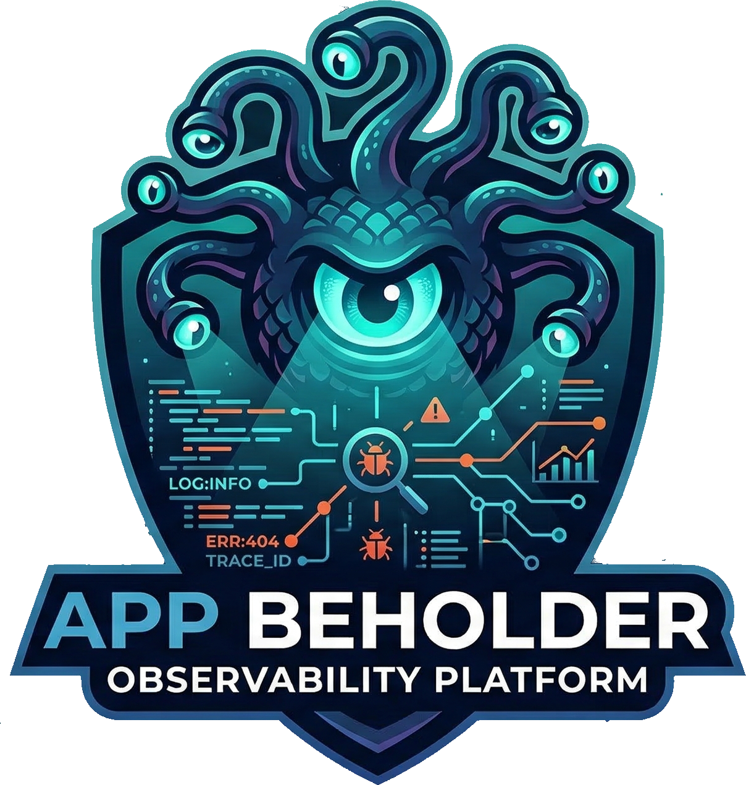
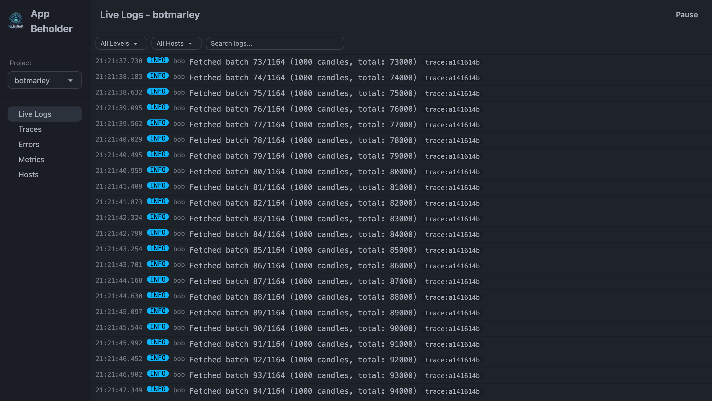
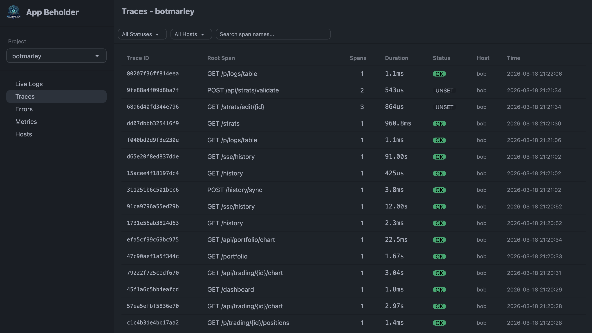
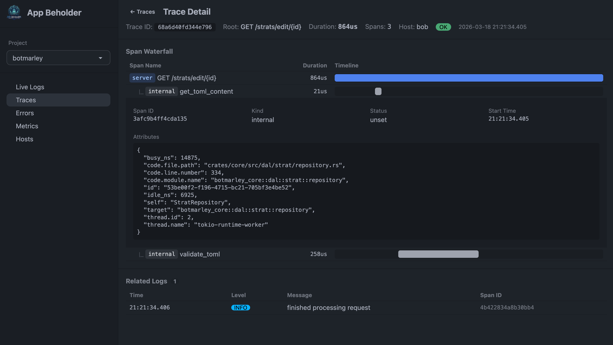
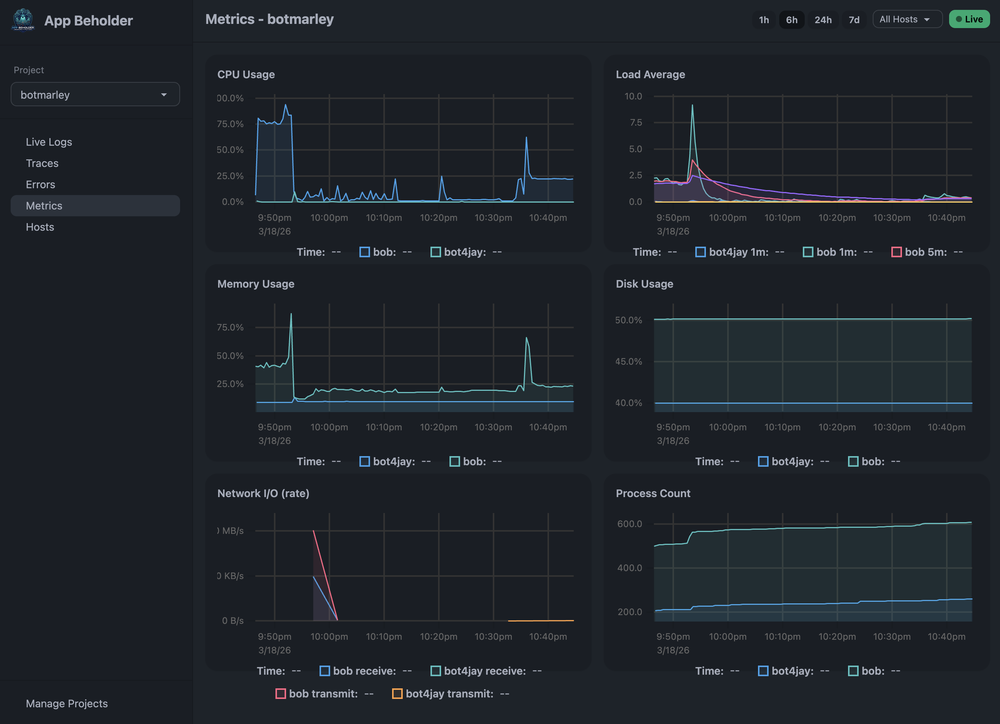
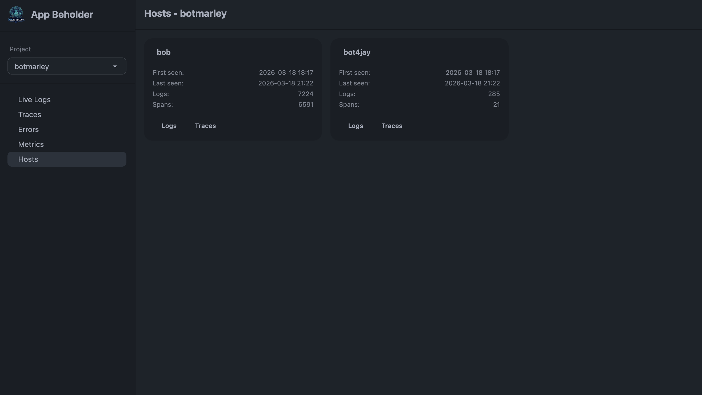

<p align="center">
  
</p>

<p align="center">
  <strong>Self-hosted observability platform built in Rust</strong><br/>
  Logs, traces, errors, and server metrics — all in one place.
</p>

<p align="center">
  <a href="https://github.com/mi4uu/appbeholder/actions/workflows/release.yml"></a>
  <a href="https://github.com/mi4uu/appbeholder/releases/latest"></a>
</p>

<p align="center">
  <a href="#features">Features</a> &bull;
  <a href="#quick-start">Quick Start</a> &bull;
  <a href="#sending-data">Sending Data</a> &bull;
  <a href="#frontend-error-tracking">Frontend Errors</a> &bull;
  <a href="#server-metrics-agent">Metrics Agent</a> &bull;
  <a href="#configuration">Configuration</a>
</p>

---

## Why App Beholder?

Most observability tools are either expensive SaaS products or complex self-hosted stacks requiring Kafka, Elasticsearch, and a PhD in YAML configuration.

App Beholder is different: **one binary, one database, zero complexity.** Deploy it in minutes and start seeing what your apps are doing.

- No vendor lock-in — your data stays on your infrastructure
- No complex pipelines — just POST JSON or use OpenTelemetry
- No heavy dependencies — just PostgreSQL
- Real-time streaming — logs appear instantly via SSE

## Features

### Live Log Stream

Real-time scrolling log view with level, host, and text filtering. Logs stream in via Server-Sent Events as they arrive. Click any log entry to see full attributes and stack traces. Jump from a log directly to its trace.

<p align="center">
  
</p>

### Trace Explorer

Waterfall visualization of distributed traces. See the full span tree with timing, parent-child relationships, and error highlighting. Drill into any span to see attributes and linked logs.

<p align="center">
  
</p>

<p align="center">
  
</p>

### Metrics Dashboard

CPU, memory, swap, disk, network, and per-process metrics charted over time with multi-host support.

<p align="center">
  
</p>

### Multi-Project & Multi-Host

Track multiple applications across multiple servers. Projects are auto-created on first event — no setup required. Per-host stats with log and span counts.

<p align="center">
  
</p>

## Tech Stack

| Layer | Technology |
|-------|-----------|
| Backend | Rust, Axum, tokio-postgres |
| Frontend | HTMX, SSE, Tailwind CSS, DaisyUI |
| Charts | uPlot |
| Database | PostgreSQL (time-partitioned tables) |
| Templates | Askama (compile-time) |

## Quick Start

### Prerequisites

- PostgreSQL 14+
- Linux (amd64 or arm64) — for prebuilt binaries
- Rust 1.75+ — only if building from source

### 1. Create the database

```bash
createdb appbeholder
```

### 2a. Download prebuilt binaries (recommended)

Every push to `main` publishes ready-to-run binaries. No Rust toolchain required.

```bash
# Pick your architecture: linux-amd64 or linux-arm64
ARCH=linux-amd64

# Download the latest release
gh release download --repo mi4uu/appbeholder --pattern "appbeholder-${ARCH}" --pattern "appbeholder-agent-${ARCH}" --dir .

# Make executable
chmod +x appbeholder-${ARCH} appbeholder-agent-${ARCH}

# Run the server
./appbeholder-${ARCH}
```

Or download manually from the [Releases page](https://github.com/mi4uu/appbeholder/releases/latest).

Each release includes four binaries:

| Binary | Description |
|--------|-------------|
| `appbeholder-linux-amd64` | Server (x86_64) |
| `appbeholder-linux-arm64` | Server (aarch64/Graviton) |
| `appbeholder-agent-linux-amd64` | Metrics agent (x86_64) |
| `appbeholder-agent-linux-arm64` | Metrics agent (aarch64/Graviton) |

### 2b. Build from source

```bash
git clone https://github.com/mi4uu/appbeholder.git
cd appbeholder
cargo build --release -p appbeholder
cargo build --release -p appbeholder-agent

# Run the server
./target/release/appbeholder
```

### 3. Send your first log

```bash
curl -X POST http://localhost:8080/api/v1/logs \
  -H "Content-Type: application/json" \
  -H "X-Project-Slug: my-app" \
  -d '{"level":"info","message":"Hello from App Beholder!"}'
```

Open `http://localhost:8080` — your project appears automatically and the log is streaming live.

## Sending Data

### REST API

All endpoints require the `X-Project-Slug` header to identify the project. The host is auto-detected from the request IP, or you can set it explicitly with `X-Host`.

#### POST /api/v1/logs

```json
{
  "level": "error",
  "message": "Failed to connect to database",
  "timestamp": "2026-03-18T12:00:00Z",
  "trace_id": "abc123",
  "attributes": { "module": "db", "retry_count": 3 },
  "stack_trace": "Error: connection refused\n  at db.connect..."
}
```

| Field | Type | Required | Description |
|-------|------|----------|-------------|
| `level` | string | yes | `debug`, `info`, `warn`, `error`, `fatal` |
| `message` | string | yes | Log message |
| `timestamp` | ISO 8601 | no | Defaults to server time |
| `source` | string | no | `backend` (default) or `frontend` |
| `trace_id` | string | no | For linking to traces |
| `span_id` | string | no | For linking to spans |
| `attributes` | object | no | Arbitrary key/value metadata |
| `stack_trace` | string | no | Full stack trace |

#### POST /api/v1/errors

Convenience endpoint — creates a log entry with `level=error` and auto-generates an error fingerprint for grouping.

```json
{
  "message": "TypeError: Cannot read property 'id' of null",
  "stack_trace": "TypeError: Cannot read property...\n  at UserService.getUser...",
  "source": "frontend",
  "attributes": { "url": "/dashboard", "browser": "Chrome 120" }
}
```

#### POST /api/v1/metrics

Batch endpoint for system metrics (used by the agent).

```json
{
  "metrics": [
    { "name": "cpu_usage_total", "value": 72.5, "unit": "percent" },
    { "name": "memory_used", "value": 3221225472, "unit": "bytes" },
    { "name": "process_cpu_usage", "value": 45.2, "unit": "percent",
      "attributes": { "pid": "1234", "name": "postgres" } }
  ]
}
```

### OpenTelemetry (OTLP/HTTP)

Point your OpenTelemetry SDK exporter at App Beholder:

```
OTEL_EXPORTER_OTLP_ENDPOINT=http://your-server:8080
```

Supported endpoints:
- `POST /v1/traces` — OTLP trace ingestion
- `POST /v1/logs` — OTLP log ingestion

## Frontend Error Tracking

Add a single script tag to automatically capture frontend errors:

```html
<script src="http://your-server:8080/static/beholder.js" data-project="my-app"></script>
```

This automatically captures:
- `window.onerror` — uncaught exceptions
- `unhandledrejection` — unhandled promise rejections

Errors are sent to `POST /api/v1/errors` with `source: "frontend"` and grouped by fingerprint.

## Server Metrics Agent

The `appbeholder-agent` binary collects system metrics and sends them via OTLP/HTTP.

```bash
# Using prebuilt binary
./appbeholder-agent-linux-amd64 agent.toml

# Or build from source
cargo run -p appbeholder-agent -- agent.toml
```

Create an `agent.toml`:

```toml
endpoint = "http://localhost:8080"
service_name = "my-app"
hostname = "web-1"
interval_secs = 30
```

Collected metrics:
- **CPU** — total usage, per-core usage, load average (1m/5m/15m)
- **Memory** — total, used, available
- **Swap** — total, used, free
- **Disk** — total, used, available, read/write throughput per mount
- **Network** — RX/TX bytes per interface
- **Processes** — top 10 by CPU and memory (PID, name, usage)

Metrics are sent every 10 seconds by default.

## Authentication

App Beholder uses a simple password gate. Create a `.password` file next to the binary:

```bash
echo "my-secret-password" > .password
```

- If `.password` exists: web UI requires login, API requires `X-Api-Password` header
- If `.password` doesn't exist: no authentication (open access)

## Configuration

Create a `config.toml` in the working directory:

```toml
[server]
host = "0.0.0.0"
port = 8080

[database]
url = "postgres://localhost/appbeholder"

[retention]
logs_days = 7        # How long to keep logs
traces_days = 30     # How long to keep traces
metrics_days = 90    # How long to keep metrics
errors_days = 30     # How long to keep error groups
```

All values have sensible defaults — the config file is optional.

## Architecture

```
+-------------------+     +--------------------+
|  Client Apps      |     |  appbeholder-agent  |
|  (OTLP / REST)   |     |  (system metrics)   |
+---------+---------+     +---------+----------+
          |                         |
          v                         v
+-------------------------------------------------+
|             App Beholder Server                  |
|  +-----------+  +-----------------------------+  |
|  | OTLP HTTP |  |  REST API                   |  |
|  | Receiver  |  |  (logs/errors/metrics/spans) |  |
|  +-----+-----+  +-------------+---------------+  |
|        |                      |                   |
|        v                      v                   |
|  +-------------------------------------------+   |
|  |  Ingestion Pipeline                        |   |
|  |  (normalize, enrich, fingerprint, batch)   |   |
|  +--------------------+-----------------------+   |
|                       v                           |
|  +-------------------------------------------+   |
|  |  PostgreSQL (partitioned by day)           |   |
|  +--------------------+-----------------------+   |
|                       v                           |
|  +-------------------------------------------+   |
|  |  Web UI (HTMX + SSE + Tailwind/DaisyUI)   |   |
|  +-------------------------------------------+   |
+-------------------------------------------------+
```

Single binary. PostgreSQL is the only external dependency.

## License

This work is licensed under [CC BY-NC-SA 4.0](https://creativecommons.org/licenses/by-nc-sa/4.0/).

**You are free to:**
- Share and adapt this software for non-commercial purposes

**Under the following terms:**
- **Attribution** — Credit to [Michal Lipinski](https://lipinski.work/) with a link to this repository
- **NonCommercial** — No commercial use without a separate license agreement
- **ShareAlike** — Derivatives must use the same license

For commercial licensing inquiries, contact the author.
